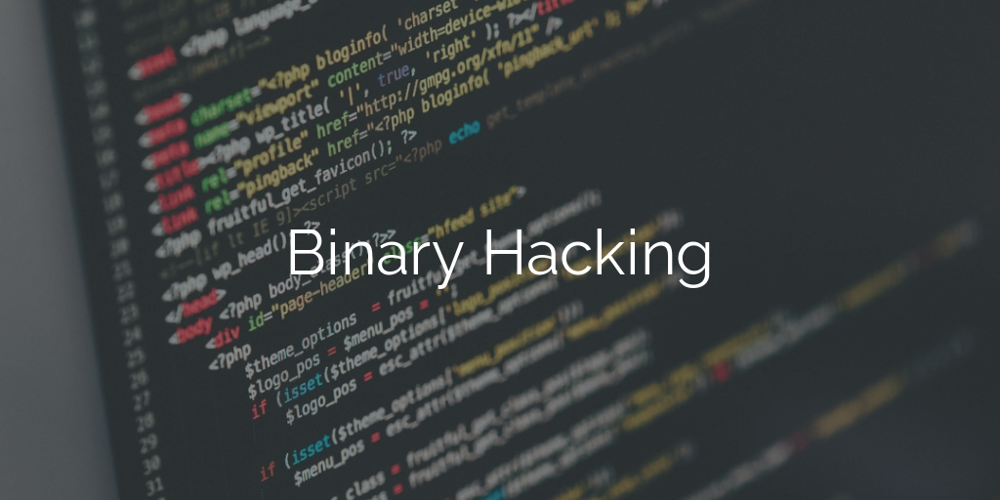

# Hacking Games, Challenges, Security...



I wanted to learn more about security, so I decided to start doing hacking games
exercises also known as CRACKMEs, CTFs, etc. apparently.

# Summary
* [WarGames by OverTheWire](#wargames)
* [LiveOverflow](#liveoverflow)

# WarGames

* [OverTheWire's website](http://overthewire.org)
* current level: [bandit11@wargames](http://overthewire.org/wargames/bandit/bandit12.html)

## Cheat codes

There's no point for you to just copy-paste password into ssh connections, since
you wouldn't learn a single thing so I guess I can just put them here. I need to
save my progression somewhere anyway.

### Login in

To connect using SSH use: `ssh -p 2220bandit0@bandit.labs.overthewire.org`
  > it becomes `ssh banditx@localhost` once you're already connected

### From level N to N + 1

1. `boJ9jbbUNNfktd78OOpsqOltutMc3MY1`
2. `CV1DtqXWVFXTvM2F0k09SHz0YwRINYA9`
2. `UmHadQclWmgdLOKQ3YNgjWxGoRMb5luK`
2. `pIwrPrtPN36QITSp3EQaw936yaFoFgAB`
2. `koReBOKuIDDepwhWk7jZC0RTdopnAYKh`
2. `DXjZPULLxYr17uwoI01bNLQbtFemEgo7`
2. `HKBPTKQnIay4Fw76bEy8PVxKEDQRKTzs`
2. `cvX2JJa4CFALtqS87jk27qwqGhBM9plV`
2. `UsvVyFSfZZWbi6wgC7dAFyFuR6jQQUhR`
2. `truKLdjsbJ5g7yyJ2X2R0o3a5HQJFuLk`
2. `IFukwKGsFW8MOq3IRFqrxE1hxTNEbUPR`
2. `5Te8Y4drgCRfCx8ugdwuEX8KFC6k2EUu`
2. `8ZjyCRiBWFYkneahHwxCv3wb2a1ORpYL`

### Things I've learnt

Always use `file`.

```
find . -type f -executable -print
find . -type f -size 1033c -print
find . -type f -user username
find . -type f -group groupname
find . -type f condition -a condition -o another_condition
```

`grep -w 'string'` matches 'string' only.

You can use `tr` to create a rot13 translator.

You can reverse an hex dump using `xxd -r filename > file_output`

# LiveOverflow
* [OverTheWire's Binary Hacking playlist](https://www.youtube.com/playlist?list=PLhixgUqwRTjxglIswKp9mpkfPNfHkzyeN)

This isn't a proper hacking game exercises website, but I had a hard time
finding MOOCs or courses about binary hacking and this guy's videos helped me a
lot to get started.

# To see later queue
* [This repo seems to have a lot of cool security challenges links](https://github.com/rynfld/Wargames)
